## About

I'm a former frontend engineer, now building on my own. I take an idea all the way
to a shipped product — product, design, and code, without handing it off to anyone.

## Now

- **Building with vibe coding** — from a spark, to a prototype, to something people actually use
- **Sharpening product instinct** — the tools keep changing, taste and judgment are what compound
- **Shipping in the open** — the bugs I hit and the things I make end up here

## Stack

`TypeScript` `JavaScript` `React` `Vue` `Svelte` `Nuxt` `Tailwind CSS` `Node.js` `Vite` `Webpack`

## Connect

[6iedog.com](https://6iedog.com) &nbsp;·&nbsp; [GitHub](https://github.com/6iedog)